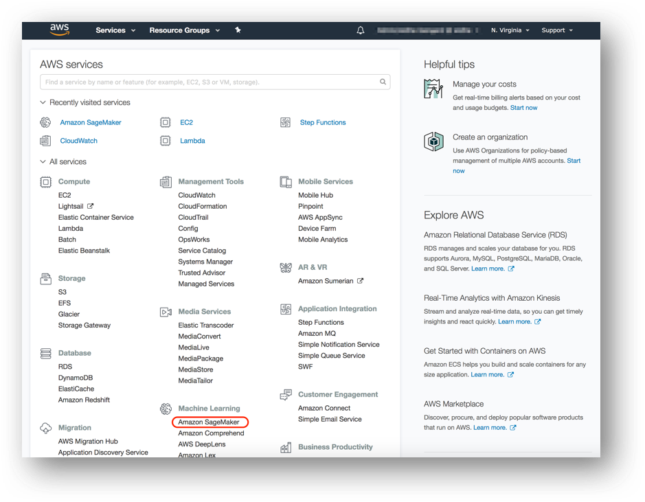
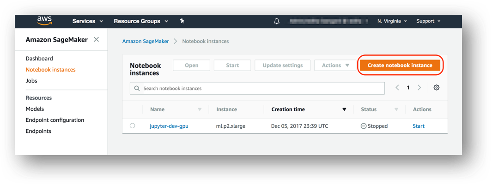
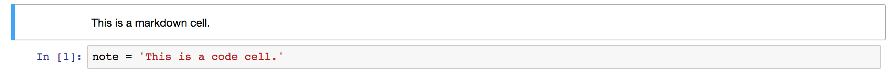

# Creating a Notebook Instance

We'll start by creating an Amazon S3 bucket that will be used throughout the workshop.  We'll then create a SageMaker notebook instance, which we will use for the other workshop modules.

## 1. Create a S3 Bucket

SageMaker typically uses S3 as storage for data and model artifacts.  In this step you'll create a S3 bucket for this purpose. To begin, sign into the AWS Management Console, https://console.aws.amazon.com/.

### High-Level Instructions

Use the console or AWS CLI to create an Amazon S3 bucket. Keep in mind that your bucket's name must be globally unique across all regions and customers. We recommend using a name like `smworkshop-firstname-lastname`. If you get an error that your bucket name already exists, try adding additional numbers or characters until you find an unused name.

<details>
<summary><strong>Step-by-step instructions (expand for details)</strong></summary><p>

1. In the AWS Management Console, choose **Services** then select **S3** under Storage.

1. Choose **+Create Bucket**

1. Provide a globally unique name for your bucket such as `smworkshop-firstname-lastname`.

1. Select the Region you've chosen to use for this workshop from the dropdown.

1. Choose **Create** in the lower left of the dialog without selecting a bucket to copy settings from.

</p></details>

## 2. Launching the Notebook Instance

1. In the upper-right corner of the AWS Management Console, confirm you are in the desired AWS region. Select N. Virginia, Oregon, Ohio, or Ireland.

2. Click on Amazon SageMaker from the list of all services.  This will bring you to the Amazon SageMaker console homepage.



3. To create a new notebook instance, go to **Notebook instances**, and click the **Create notebook instance** button at the top of the browser window.



4. Type smworkshop-[First Name]-[Last Name] into the **Notebook instance name** text box, and select ml.m4.xlarge for the **Notebook instance type**.


5. For IAM role, choose **Create a new role**, and in the resulting pop-up modal, select **Specific S3 buckets** under **S3 Buckets you specify – optional**. In the text field, paste the name of the S3 bucket you created above, AND the following bucket name separated from the first by a comma:  `gdelt-open-data`.  The combined field entry should look similar to ```smworkshop-john-smith, gdelt-open-data```. Click **Create role**.


6. You will be taken back to the Create Notebook instance page.  Click **Create notebook instance**.

### 3. Accessing the Notebook Instance

1. Wait for the server status to change to **InService**. This will take several minutes, possibly up to ten but likely less.


2. Click **Open**. You will now see the Jupyter homepage for your notebook instance.


### Jupyter Notebooks:  A Brief Overview

Jupyter is an open-source web application that allows you to create and share documents that contain live code, equations, visualizations and narrative text. Uses include: data cleaning and transformation, numerical simulation, statistical modeling, data visualization, machine learning, and much more. With respect to code, it can be thought of as a web-based IDE that executes code on the server it is running on instead of locally. 

There are two main types of "cells" in a notebook:  code cells, and "markdown" cells with explanatory text. You will be running the code cells.  These are distinguished by having "In" next to them in the left margin next to the cell, and a greyish background.  Markdown cells lack "In" and have a white background. In the screenshot below, the upper cell is a markdown cell, while the lower cell is a code cell:



To run a code cell, simply click in it, then either click the **Run Cell** button in the notebook's toolbar, or use Control+Enter from your computer's keyboard. It may take a few seconds to a few minutes for a code cell to run. You can determine whether a cell is running by examining the `In[]:` indicator in the left margin next to each cell:  a cell will show `In [*]:` when running, and `In [a number]:` when complete.

Please run each code cell in order, and **only once**, to avoid repeated operations.  For example, running the same training job cell twice might create two training jobs, possibly exceeding your service limits.

## Cloning this Repository
Once you have started a Sagemaker notebook instance, you're going to clone this GitHub repository to that instance. This means that you will be able to read all of these files and run these commands from your notebook instance.  

1. Navigate to your notebook instance. Click 'New,' then 'Terminal.'

2. Navigate to the 'Running' tab, and click on 'Terminal.'

3. You'll see a black box with a blinking white cursor. That is the command line, or bash shell, for your notebook instance. Type 'pwd' to see where you are on the instance, and type 'ls' to see what folders are below you.

4. Type 'cd SageMaker' to drop into the Sagemaker directory. Then type 'ls' to see what folders are in this directory.

5. Now type 'git clone https://github.com/EmilyWebber/Banking-On-AI.git'. You should see some activity on the terminal after you enter this command. After the activity has completed, type 'ls' again to see what folders are now in this directory.  If you see 'Banking-On-AI' in the list, you've cloned this repository to that instance!
