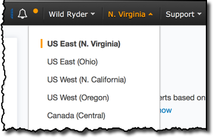

# Amazon SageMaker Workshops

Amazon SageMaker is a fully managed service that enables developers and data scientists to quickly and easily build, train, and deploy machine learning models at any scale. This repository contains a collection of workshops and other hands on content that will guide you through using the many features of SageMaker.  

# Prerequisites

## AWS Account

In order to complete this workshop you'll need an AWS Account and an AWS IAM user with access to create AWS IAM, Amazon S3, and Amazon SageMaker resources. The code and instructions in this workshop assume only one student is using a given AWS account at a time. If you try sharing an account with another student, you'll run into naming conflicts for certain resources. You can work around these by appending a unique suffix to the resources that fail to create due to conflicts, but the instructions do not provide details on the changes required to make this work. Use a personal account or create a new AWS account for this workshop rather than using an organization’s account to ensure you have full access to the necessary services and to ensure you do not leave behind any resources from the workshop.

To avoid charges for endpoints and other resources you might not need after you've finished a workshop, please refer to the [**Cleanup Guide**](./CleanupGuide). 

## AWS Region

SageMaker is not available in all AWS Regions at this time.  Accordingly, we recommend running this workshop in one of the following supported AWS Regions:  N. Virginia, Oregon, Ohio, or Ireland.

Once you've chosen a region, you should create all of the resources for this workshop there, including a new Amazon S3 bucket and a new SageMaker notebook instance. Make sure you select your region from the dropdown in the upper right corner of the AWS Console before getting started.

## Browser

We recommend you use the latest version of Chrome or Firefox to complete this workshop.
